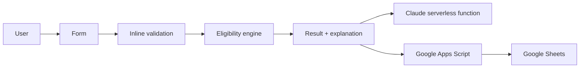

# AI Loan Eligibility Checker

A responsive vanilla HTML/CSS/JavaScript BFSI experience for Indian users. LoanCheck provides an educational eligibility estimate, credit-factor analyzer, EMI planning tool, and optional AI finance tips without collecting Aadhaar, PAN, bank details, passwords, or card data.

> **Important:** Results are estimates for educational use only. They are not a loan approval, lender decision, credit-bureau score, or financial advice.

## What is included

- `index.html` — SEO-friendly single-page UI with accessible navigation and four modules.
- `style.css` — Midnight Fintech Glass visual system, responsive layout, motion, focus states, meters, gauges, and toasts.
- `script.js` — Vanilla-JS application controller, validation, eligibility engine, credit analyzer, EMI calculator, Canvas donut, amortization table, chat UI, local history, and integration fallbacks.
- `netlify/functions/ai-tips.js` — secure Claude proxy; the Anthropic key is read only from server environment variables.
- `netlify.toml` — Netlify static publish and `/api/ai-tips` redirect.
- `server.js` and `Dockerfile` — managed production serving path for the static app plus the same secure AI function bridge.
- `apps-script/Code.gs` — Google Apps Script `doPost` and `doGet` backend.
- `manus-routes.json` — current page route manifest. It intentionally lists page routes only; CSS, JavaScript, images, and `/api/ai-tips` are assets/API paths rather than application pages.
- `ideas.md` — approved design direction.

## Run locally

This is a dependency-free static frontend. From the project root:

```bash
python3 -m http.server 3000 --bind 0.0.0.0
```

Open `http://localhost:3000`. The form, credit analyzer, EMI calculator, local Recent Checks history, and AI fallback work without credentials. The Claude endpoint itself requires a serverless deployment; a plain static server will intentionally fall back when `/api/ai-tips` is unavailable.

The managed production container uses `node server.js` and honors the platform `PORT` environment variable. Netlify deployments can use `netlify.toml` and the function directory instead.

## Claude / Anthropic setup

1. Deploy the repository to Netlify (or adapt `netlify/functions/ai-tips.js` to a Vercel function).
2. Add `ANTHROPIC_API_KEY` as a server-side environment variable. Never add it to `index.html`, `script.js`, browser storage, or a public repository.
3. Optionally add `ANTHROPIC_MODEL`; the default is documented in the function and can be changed per deployment.
4. The frontend calls the relative path `/api/ai-tips`. The function validates the payload, constrains the system prompt, applies a timeout, and returns a safe deterministic fallback for missing credentials or upstream failure.

## Google Sheets setup

1. Create a Google Sheet and open **Extensions → Apps Script**.
2. Paste the complete contents of `apps-script/Code.gs` and save.
3. Run `doGet` once from the Apps Script editor if Google asks you to authorize the spreadsheet.
4. Choose **Deploy → New deployment → Web app**.
5. Set “Execute as” to your account and choose the access policy appropriate for your use case. Copy the deployed web-app URL.
6. In `script.js`, set `APP_CONFIG.sheetsEndpoint` to that URL, or set `localStorage.loancheckSheetsEndpoint` in the browser for a no-code test.
7. Reload LoanCheck. Successful form submissions are sent to `doPost`; the client requires the JSON response to contain `ok: true` before showing a remote-save success toast, then refreshes Recent Checks from `doGet`. If the endpoint is unavailable or returns a logical error, the app keeps a local browser copy and shows a warning rather than claiming the record was saved remotely.

The backend writes only these fields: `name`, `email`, `phone`, `income`, `creditScore`, `loanType`, `requestedAmount`, `eligibilityScore`, `verdict`, and `timestamp`. Do not extend the script with Aadhaar, PAN, bank-account, card, password, or identity-document fields.

## Eligibility engine

The score is out of 100:

- Credit score: 35%
- Income-to-EMI / FOIR: 30%
- Employment stability: 15%
- Age: 10%
- Existing obligations: 10%

FOIR is `(existing monthly EMIs + estimated new EMI) / monthly income`; the comfort rule is 50% or lower. The UI validates ages 21–60, maturity at or before 65, positive financial values, 300–900 credit scores, Indian 10-digit phone numbers, minimum income of ₹ 15,000 for salaried profiles and ₹ 25,000 for self-employed/business profiles, and sensible loan/tenure ranges.

The verdict bands are **Highly Eligible** for 75–100, **Moderately Eligible** for 50–74, and **Not Eligible** below 50. A credit score below 650 is called out as higher risk and can prevent a high-eligibility verdict even when the weighted score is otherwise strong.

## EMI formula

`EMI = P × r × (1+r)^n / ((1+r)^n − 1)` where `P` is principal, `r` is monthly interest rate, and `n` is the number of months. A zero-rate branch returns `P / n`.

## Architecture workflow



The public frontend is static and browser-rendered. The Claude endpoint is dynamic and private/no-store. Google Sheets is an optional user-configured integration. The app uses relative browser URLs and does not guess canonical metadata before the deployment origin is known.

## Quality and privacy notes

- No alert dialogs; validation errors are inline and integration states use accessible toasts/live regions.
- All key controls have labels and visible focus states; reduced-motion users receive instant transitions.
- Financial outputs are illustrative and should be checked against the lender’s official offer documents.
- `robots.txt` blocks the API path. `sitemap.xml` intentionally contains no guessed hostname; add the actual published URL after deployment.

## Future enhancements

User authentication, an ML-based prediction model trained and audited on consented data, PDF report generation, multilingual support, and lender-specific product comparisons.
